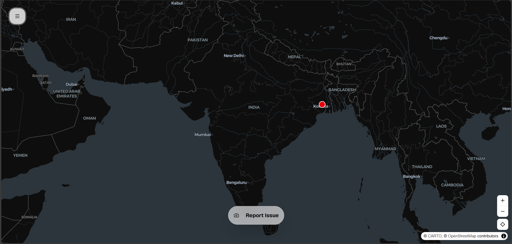

Important links to proceed with:
https://console.cloud.google.com/freetrial/signup/billing/IN?authuser=4
https://developers.google.com/maps/documentation/geocoding/usage-and-billing
https://unswachh.vercel.app/    

# NotSoSwachh



**Crowdsourcing a cleaner India, one report at a time.**


NotSoSwachh is a map-based reporting platform designed to empower citizens to identify and report waste, sewage, and public hygiene issues. By leveraging community-driven verification and transparent public data, we aim to bridge the gap between reported issues and official action.

---

## Key Features

- **Map-Based Reporting**: Precision location marking using interactive maps.
- **Evidence Submission**: Instant photo upload with client-side compression for efficiency.
- **Reverse Geocoding**: Automatically detects human-readable addresses for all reports.
- **Community Voting**: Reddit-style upvoting and downvoting to prioritize urgent issues.
- **Shielded Admin Panel**: Secure dashboard for moderators to approve, edit, or remove reports.
- **Proximity Detection**: Intelligent 50m radius check to prevent duplicate reporting of the same issue.
- **Navigation Ready**: Direct links to Google Maps and the official Swachh Bharat app.

---

## Tech Stack

- **Framework**: [Next.js 15](https://nextjs.org/) (App Router)
- **Styling**: [Tailwind CSS v4](https://tailwindcss.com/) + [Shadcn/UI](https://ui.shadcn.com/)
- **Database**: [Firebase Firestore](https://firebase.google.com/products/firestore)
- **Storage**: [Cloudinary](https://cloudinary.com/) (Unsigned Uploads)
- **Maps**: Mapcn.dev (Uses MapLibre GL under the hood)
- **Icons**: [Lucide React](https://lucide.dev/) + [React Icons](https://react-icons.github.io/react-icons/)

---

## Getting Started

### 1. Clone & Install
```bash
git clone https://github.com/bikash1376/not-so-swachh.git
cd not-so-swachh
npm install
```

### 2. Environment Setup
Create a `.env.local` file with the following variables:
```env
# Firebase Configuration
NEXT_PUBLIC_FIREBASE_API_KEY=your_key
NEXT_PUBLIC_FIREBASE_AUTH_DOMAIN=your_domain
NEXT_PUBLIC_FIREBASE_PROJECT_ID=your_id
NEXT_PUBLIC_FIREBASE_STORAGE_BUCKET=your_bucket
NEXT_PUBLIC_FIREBASE_MESSAGING_SENDER_ID=your_id
NEXT_PUBLIC_FIREBASE_APP_ID=your_id

# Cloudinary Configuration
NEXT_PUBLIC_CLOUDINARY_CLOUD_NAME=your_name
NEXT_PUBLIC_CLOUDINARY_UPLOAD_PRESET=your_preset

# Admin Credentials
NEXT_PUBLIC_ADMIN_PASSWORD=your_secure_password
```

### 3. Run Locally
```bash
npm run dev
```

---

## Contributing
Contributions are welcome! Feel free to open issues or submit pull requests to help make India cleaner.

## Created by
**Bikash** - [Follow on X](https://x.com/bikash1376)
